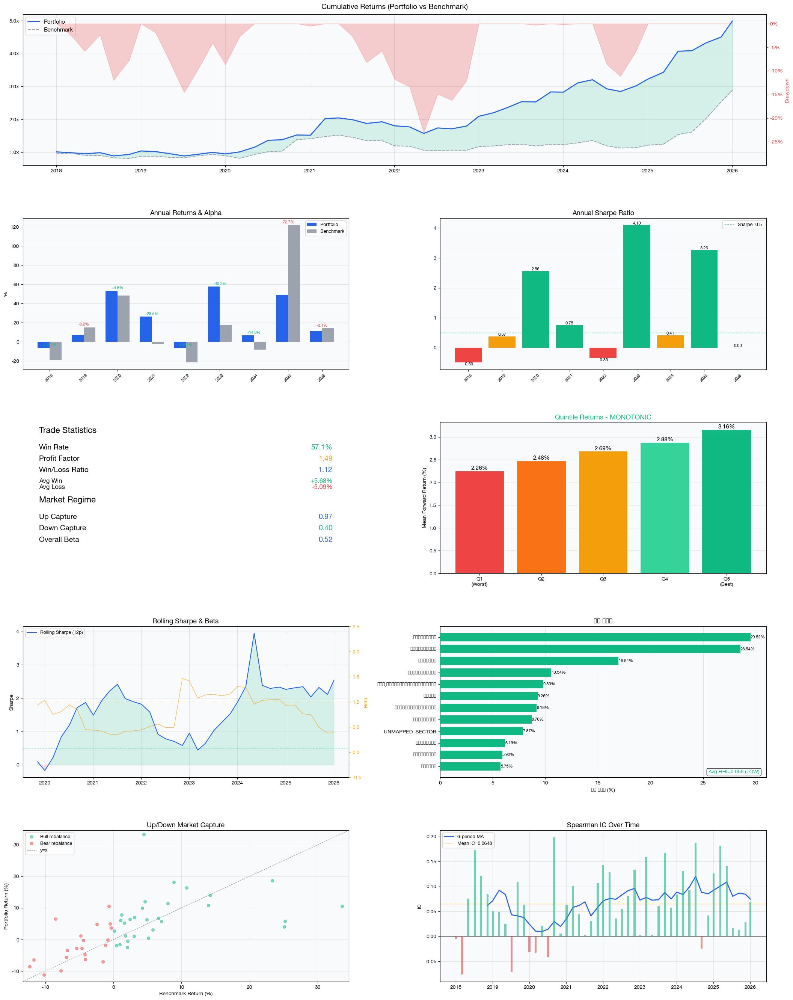

# AlphaKRX

**Korean equity quantitative trading system** — KRX data pipeline, LightGBM ranking model, walk-forward backtest, and automated live rebalancing via Kiwoom REST API.

---

## Backtest Results (2018–2026, 9 years out-of-sample)

| | Strategy | Benchmark (KOSPI 200) |
|--|--|--|
| **Total Return** | **+368.6%** | +188.4% |
| **Ann. Return** | **+18.7%** | — |
| **Sharpe Ratio** | **0.93** | — |
| **Calmar Ratio** | **0.83** | — |
| **Max Drawdown** | -22.5% | — |
| **Alpha** | **+180.1%** | — |
| **Beta** | 0.54 | 1.0 |
| **Up / Down Capture** | 0.98 / 0.47 | 1.0 / 1.0 |
| **IC / IC IR** | 0.065 / 0.94 | — |
| **Hit Rate** | 55.1% (27/49 periods) | — |



*Statistical significance: OLS t-stat 2.89 (p=0.006), Newey-West HAC t-stat 2.66 (p=0.011), IC t-stat 6.61 (p=0.000), Bootstrap Sharpe 95% CI [0.39, 1.81] — all pass at 5%; OLS/IC pass at 1%.*

**Config:** `--start 20100101 --min-market-cap 200B KRW --horizon 42d --top-n 50 --buy-rank 28 --hold-rank 90 --train-years 3 --buy-fee 0.05% --sell-fee 0.25% --no-cash-out`

### Annual Breakdown

| Year | Return | Alpha | Sharpe |
|------|--------|-------|--------|
| 2018 | -6.6% | +12.1% | -0.50 |
| 2019 | +6.8% | -8.2% | 0.37 |
| 2020 | +49.4% | +1.2% | 2.21 |
| 2021 | +27.1% | +29.4% | 0.76 |
| 2022 | -6.0% | +15.7% | -0.32 |
| 2023 | +59.8% | +42.3% | 4.55 |
| 2024 | +0.4% | +8.7% | 0.02 |
| 2025 | +47.6% | -74.2%* | 3.09 |
| 2026 | +11.2% | -2.7% | N/A (partial) |

*\*2025 alpha is negative because KOSPI 200 returned ~90% in 2025 (K-defense/AI boom). Portfolio still returned +47.6% in absolute terms.*

*Annual figures are based on rebalancing windows (~6 per year), not strict calendar years. The last rebalancing window of each year extends ~43 trading days into the following year, so annual alpha figures are for directional intuition only — do not sum or compound them. Total return (+368.6%) and overall alpha (+180.1%) are computed from the full equity curve and are the authoritative figures.*

### Robustness Tests

| Test | Sharpe | Status |
|------|--------|--------|
| Long-Short (top 10% − bottom 10%) | 0.77 | OK |
| Beta-Hedged (β=0.54) | 0.68 | OK |
| Ex-2023 (remove best year) | 0.71 | PASS ≥0.70 |
| Turnover reduction (61%→48%) | 0.89 | OK |

---

## Tech Stack

Python · LightGBM · SQLite · pandas · pykrx · Kiwoom REST API

---

## Where Alpha Comes From

| Feature Group | Importance | Signal |
|---|---|---|
| Sector-relative low volatility | 22.2% | Stocks quieter than sector peers (vol, turnover z-scores) |
| Quality / Profitability | 22.1% | ROE, gross profitability (GPA), sector-relative ROE |
| Market regime | 15.7% | Index membership count, 120d market trend |
| Academic momentum | 13.6% | MA crossovers, 52-week high proximity |
| Sector momentum | 9.2% | Relative sector strength and breadth |
| Distress avoidance | 6.7% | Liquidity decay, low-price traps, distress composite |
| Volume / liquidity | 5.7% | Amihud illiquidity, volume ratio |

---

## Bias Controls

- **No look-ahead on financials** — IFRS data only used after 45/90-day publication lag (point-in-time)
- **Walk-forward with 43-day embargo** — model never sees test-period data; purge gap ≥ horizon (42d) + execution lag (1d) between train and test windows
- **Survivorship-bias-free** — delisted stocks included in universe up to their last trading date; pre-delisting returns recomputed from last traded price
- **Execution lag test** — Sharpe holds at T+1 execution (close → next day), confirming alpha is not dependent on filling at the exact closing price
- **Independent verification** — all trades cross-checked against Naver Finance adjusted prices via a separate script (`verification/verify_backtest.py`)

---

## How It Works

```
KRX Market Data + Financial Statements
            │
       ETL Pipelines  ──►  SQLite DB
            │
   36 Features × 9 Groups        ← momentum, sector, volatility,
   (registry pattern)                fundamental, distress, ...
            │
   LightGBM Ranker                ← walk-forward, Huber loss,
   (per-year fold)                   PIT-safe, bias-controlled
            │
   Top-N Portfolio                ← rebalance every 42 trading days
            │
   Kiwoom REST API  ──►  Live Orders
```

---

## Quick Start

### 1. Update data

```bash
python3 scripts/run_etl.py update --markets kospi,kosdaq --workers 4
```

### 2. Run a backtest

```bash
python3 scripts/run_backtest.py \
  --start 20100101 \
  --min-market-cap 200000000000 \
  --horizon 42 --top-n 50 \
  --buy-rank 28 --hold-rank 90 \
  --train-years 3 \
  --buy-fee 0.05 --sell-fee 0.25 \
  --no-cash-out
```

### 3. Get today's picks

```bash
python3 scripts/get_picks.py --model-path runs/myrun/model.pkl --top 20
```

### 4. Live rebalancing

```bash
python3 scripts/run_live.py --run myrun          # dry-run: check schedule
python3 scripts/run_live.py --run myrun --execute # execute orders
```

---

## Automated Scheduling

```bash
./scripts/setup_scheduler.sh start --run myrun --hour 7 --min 30
sudo pmset repeat wakeorpoweron MTWRF 07:25:00   # wake Mac from sleep
./scripts/setup_scheduler.sh status
./scripts/setup_scheduler.sh stop
```

> **Timezone (HKT = UTC+8):** Korean market opens 9:00 AM KST = 8:00 AM HKT. Run before 8:00 AM HKT.

---

## Kiwoom API Setup

Create `.env` in the project root (already in `.gitignore`):

```
KIWOOM_APP_KEY=your_app_key
KIWOOM_APP_SECRET=your_app_secret
KIWOOM_ACCOUNT=12345678-01
KIWOOM_MOCK=true       # true = paper trading, false = real money
```

---

## Documentation

| Doc | Contents |
|-----|----------|
| [docs/SETUP.md](docs/SETUP.md) | Install, configure, first backtest, interpret results |
| [docs/ARCHITECTURE.md](docs/ARCHITECTURE.md) | System diagram, directory structure, design principles |
| [docs/LIVE_TRADING.md](docs/LIVE_TRADING.md) | Kiwoom setup, live workflow, scheduler |
| [docs/etl/ETL.md](docs/etl/ETL.md) | ETL pipelines, unified runner, validation commands |
| [docs/etl/DATABASE.md](docs/etl/DATABASE.md) | Database schema (all 7 tables) |
| [docs/model/MODEL.md](docs/model/MODEL.md) | Training architecture, universe filters, how to extend |
| [docs/model/FEATURES.md](docs/model/FEATURES.md) | 36-feature reference tables |
| [docs/model/BACKTEST.md](docs/model/BACKTEST.md) | CLI flags, model hyperparameters |
| [docs/bias/DATA.md](docs/bias/DATA.md) | Look-ahead bias + survivorship bias controls |
| [docs/bias/EVAL.md](docs/bias/EVAL.md) | Execution, small-sample, liquidity bias + summary table |
| [verification/README.md](verification/README.md) | Independent backtest verification |

---

## Disclaimer

For educational and research purposes only. Past performance does not guarantee future results. Not financial advice.
