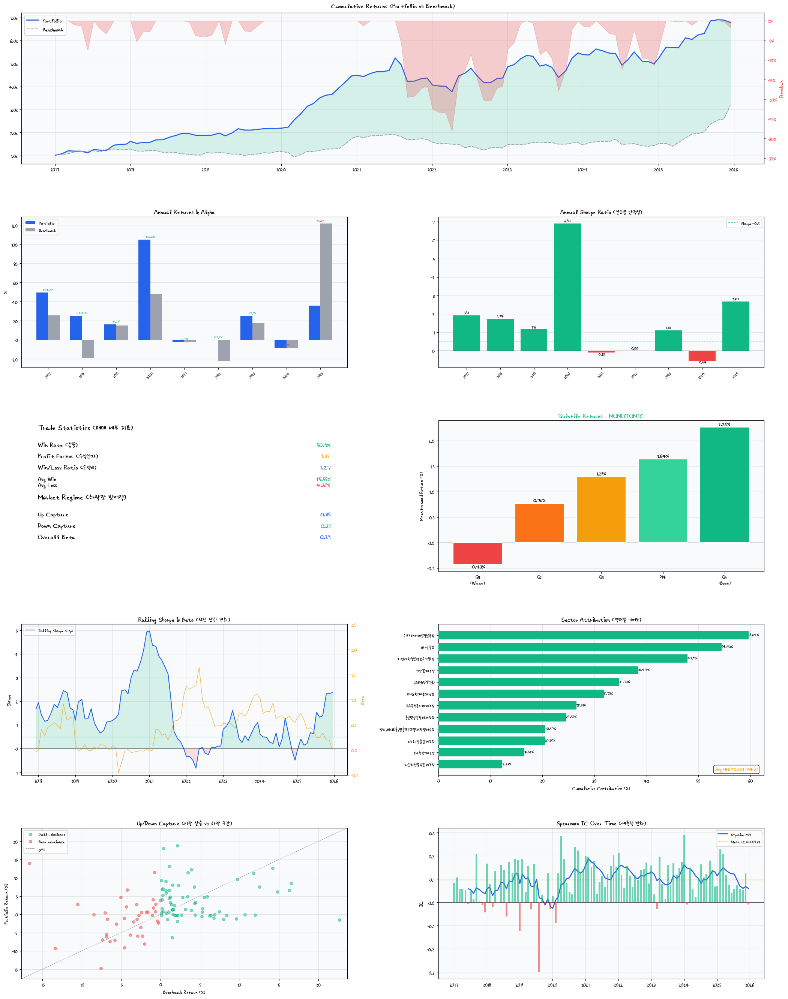

# AlphaKRX

**Korean equity quantitative trading system** — KRX data pipeline, LightGBM ranking model, walk-forward backtest, and automated live rebalancing via Kiwoom REST API.

---

## Backtest Results (2017–2025, 9 years out-of-sample)

| | Strategy | Benchmark (KOSPI 200) |
|--|--|--|
| **Total Return** | **+579.1%** | +218.4% |
| **Ann. Return** | **+23.7%** | — |
| **Sharpe Ratio** | **1.21** | — |
| **Max Drawdown** | -28.0% | — |
| **Alpha** | **+360.8%** | — |
| **Beta** | 0.29 | 1.0 |
| **Down Capture** | 0.31 | 1.0 |
| **IC / IC IR** | 0.097 / 1.11 | — |

*Statistical significance: Sharpe t-stat 3.56 (p=0.001), Newey-West HAC t-stat 3.61 (p=0.000), IC t-stat 11.48 (p=0.000), Bootstrap Sharpe CI [0.58, 2.20] — all pass at 1%.*



---

## How It Works

```
KRX Market Data + Financial Statements
            │
       ETL Pipelines  ──►  SQLite DB
            │
   36 Features × 9 Groups        ← momentum, sector, volatility,
   (registry pattern)                fundamental, distress, ...
            │
   LightGBM Ranker                ← walk-forward, Huber loss,
   (per-year fold)                   PIT-safe, bias-controlled
            │
   Top-N Portfolio                ← rebalance every 21 trading days
            │
   Kiwoom REST API  ──►  Live Orders
```

---

## Quick Start

### 1. Update data

```bash
python3 scripts/run_etl.py update --markets kospi,kosdaq --workers 4
```

### 2. Run a backtest

```bash
python3 scripts/run_backtest.py \
  --start 20100101 --end 20260101 \
  --horizon 21 --top-n 10 \
  --train-years 2 \
  --min-market-cap 100000000000 --max-market-cap 1000000000000 \
  --buy-rank 10 --hold-rank 120 \
  --buy-fee 0.05 --sell-fee 0.25 \
  --patience 100 --no-cache \
  --output myrun --save-picks
```

### 3. Get today's picks

```bash
python3 scripts/get_picks.py --model-path runs/myrun/model.pkl --top 20
```

### 4. Live rebalancing

```bash
python3 scripts/run_live.py --run myrun          # dry-run: check schedule
python3 scripts/run_live.py --run myrun --execute # execute orders
```

---

## Automated Scheduling

```bash
./scripts/setup_scheduler.sh start --run myrun --hour 7 --min 30
sudo pmset repeat wakeorpoweron MTWRF 07:25:00   # wake Mac from sleep
./scripts/setup_scheduler.sh status
./scripts/setup_scheduler.sh stop
```

> **Timezone (HKT = UTC+8):** Korean market opens 9:00 AM KST = 8:00 AM HKT. Run before 8:00 AM HKT.

---

## Kiwoom API Setup

Create `.env` in the project root (already in `.gitignore`):

```
KIWOOM_APP_KEY=your_app_key
KIWOOM_APP_SECRET=your_app_secret
KIWOOM_ACCOUNT=12345678-01
KIWOOM_MOCK=true       # true = paper trading, false = real money
```

---

## Documentation

| Doc | Contents |
|-----|----------|
| [docs/SETUP.md](docs/SETUP.md) | Install, configure, first backtest, interpret results |
| [docs/ARCHITECTURE.md](docs/ARCHITECTURE.md) | System diagram, directory structure, design principles |
| [docs/LIVE_TRADING.md](docs/LIVE_TRADING.md) | Kiwoom setup, live workflow, scheduler |
| [docs/etl/ETL.md](docs/etl/ETL.md) | ETL pipelines, unified runner, validation commands |
| [docs/etl/DATABASE.md](docs/etl/DATABASE.md) | Database schema (all 7 tables) |
| [docs/model/MODEL.md](docs/model/MODEL.md) | Training architecture, universe filters, how to extend |
| [docs/model/FEATURES.md](docs/model/FEATURES.md) | 36-feature reference tables |
| [docs/model/BACKTEST.md](docs/model/BACKTEST.md) | CLI flags, model hyperparameters |
| [docs/bias/DATA.md](docs/bias/DATA.md) | Look-ahead bias + survivorship bias controls |
| [docs/bias/EVAL.md](docs/bias/EVAL.md) | Execution, small-sample, liquidity bias + summary table |
| [verification/README.md](verification/README.md) | Independent backtest verification |

---

## Disclaimer

For educational and research purposes only. Past performance does not guarantee future results. Not financial advice.
