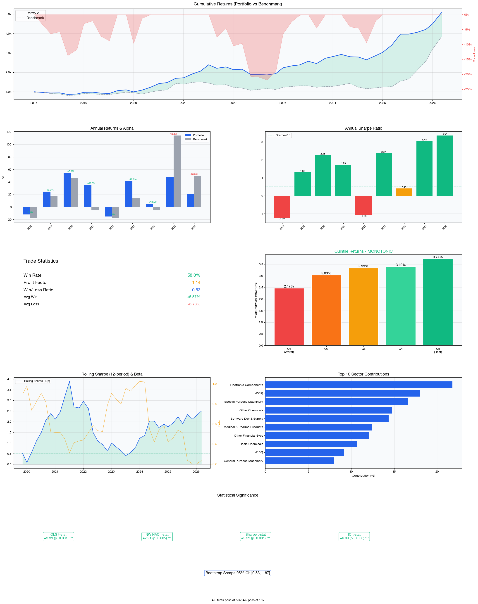

# AlphaKRX

**Korean equity quantitative trading system** — KRX data pipeline, LightGBM ranking model, walk-forward backtest, and automated live rebalancing via Kiwoom REST API.

---

## Backtest Results (2018–2026, 9 years out-of-sample)

| | Strategy | Benchmark (universe_cap) |
|--|--|--|
| **Total Return** | **+407.52%** | +283.34% |
| **Ann. Return** | **+19.78%** | — |
| **Sharpe Ratio** | **1.13** | — |
| **Calmar Ratio** | **0.90** | — |
| **Max Drawdown** | -21.87% | — |
| **Alpha** | **+124.18%** | — |
| **Beta** | 0.42 | 1.0 |
| **Up / Down Capture** | 0.76 / 0.22 | 1.0 / 1.0 |
| **Hit Rate** | 58.00% (29/50 periods) | — |



*Statistical significance: OLS t-stat 3.39 (p=0.001\*\*\*), Newey-West HAC t-stat 2.91 (p=0.005\*\*\*), Sharpe t-stat 3.39 (p=0.001\*\*\*), IC t-stat 6.09 (p=0.000\*\*\*), Bootstrap Sharpe 95% CI [0.53, 1.87] — 4/5 tests pass at 5%, 4/5 at 1%. IC Mean +0.0626, IC IR +0.86.*

**Benchmark note:** `universe_cap` is a cap-weighted portfolio of all investable stocks in the model's universe (market cap ≥ 200B KRW, KOSPI+KOSDAQ). Alpha of +124.18% is pure stock-selection skill — size and KOSDAQ premia are already in the benchmark. 2025 alpha is −66.84% because the cap-weighted benchmark was dominated by a concentrated AI/semiconductor rally; portfolio still returned +47.16% in absolute terms.

**Config:** `--start 20100101 --min-market-cap 200000000000 --benchmark universe_cap --horizon 42 --top-n 50 --buy-rank 28 --hold-rank 90 --train-years 3 --buy-fee 0.05 --sell-fee 0.25 --no-cash-out --output phase2_no_invvol --save-picks --no-cache`

### Annual Breakdown

| Year | Return | Alpha | Sharpe |
|------|--------|-------|--------|
| 2018 | -11.90% | +5.07% | -1.26 |
| 2019 | +24.48% | +6.88% | 1.30 |
| 2020 | +54.09% | +7.49% | 2.28 |
| 2021 | +34.78% | +39.60% | 1.73 |
| 2022 | -15.12% | +3.06% | -1.08 |
| 2023 | +41.01% | +27.16% | 2.37 |
| 2024 | +4.99% | +10.46% | 0.40 |
| 2025 | +47.16% | -66.84%* | 3.02 |
| 2026 | +20.50% | -28.82% | 3.35 |

*\*2025 alpha is negative because the cap-weighted universe benchmark was dominated by AI/semiconductor large caps. Portfolio returned +47.16% in absolute terms.*

*Annual figures are based on rebalancing windows (~6 per year), not strict calendar years. The last rebalancing window of each year extends ~43 trading days into the following year, so annual alpha figures are for directional intuition only — do not sum or compound them. Total return and overall alpha are computed from the full equity curve and are the authoritative figures.*

### Robustness Tests

| Test | Ann. Return / Cost | Sharpe | Status |
|------|-------------------|--------|--------|
| Long-Short (top 10% − bottom 10%) | 12.19% | 0.65 | OK |
| Beta-Hedged (β=0.42) | 11.93% | 0.82 | OK |
| Ex-2020 robustness | 16.07% | 0.98 | PASS ≥0.70 |
| Turnover reduction (61%→48%) | -2.29% | 1.00 | OK |

---

## Tech Stack

Python · LightGBM · SQLite · pandas · pykrx · Kiwoom REST API

---

## Where Alpha Comes From

| Feature Group | Importance | Signal |
|---|---|---|
| Quality / Profitability | 20.9% | ROE, GPA, sector-relative quality z-scores |
| Sector-relative low volatility | 19.7% | Stocks quieter than sector peers (vol z-scores) |
| Academic momentum | 14.1% | MA crossovers, 52-week high proximity, momentum consistency |
| Beta & liquidity risk | 14.0% | 60d rolling beta, Amihud price impact |
| Sector signals & momentum | 14.0% | Sector momentum/rotation/dispersion + sector-neutral momentum |
| Distress avoidance | 5.5% | Liquidity decay, low-price traps, distress composite |
| Market regime | 4.5% | KOSPI 200 120d MA ratio |
| Macro interaction | 4.2% | Vol-adjusted momentum, value-regime boost |
| Earnings momentum | 2.9% | YoY quarterly net income growth (DART, PIT-safe) |

---

## Bias Controls

- **No look-ahead on financials** — IFRS data only used after 45/90-day publication lag (point-in-time)
- **Walk-forward with 43-day embargo** — model never sees test-period data; purge gap ≥ horizon (42d) + execution lag (1d) between train and test windows
- **Survivorship-bias-free** — delisted stocks included in universe up to their last trading date; pre-delisting returns recomputed from last traded price
- **Execution lag test** — Sharpe holds at T+1 execution (close → next day), confirming alpha is not dependent on filling at the exact closing price
- **Independent verification** — all trades cross-checked against Naver Finance adjusted prices via a separate script (`verification/verify_backtest.py`); 2,344/2,352 verified trades match within ±5% (99.7%), mean error 0.067%, no systematic bias

---

## How It Works

```
KRX Market Data + Financial Statements
            │
       ETL Pipelines  ──►  SQLite DB
            │
   34 Features × 14 Groups       ← momentum, sector, volatility,
    (registry pattern)                fundamental, distress, ...
            │
   LightGBM Ranker                ← walk-forward, Huber loss,
   (per-year fold)                   PIT-safe, bias-controlled
            │
   Top-N Portfolio                ← rebalance every 42 trading days
            │
   Kiwoom REST API  ──►  Live Orders
```

---

## Quick Start

### 1. Update data

```bash
python3 scripts/run_etl.py update --markets kospi,kosdaq --workers 4
```

### 2. Run a backtest

```bash
python3 scripts/run_backtest.py --start 20100101 --min-market-cap 200000000000 --benchmark universe_cap --horizon 42 --top-n 50 --buy-rank 28 --hold-rank 90 --train-years 3 --buy-fee 0.05 --sell-fee 0.25 --no-cash-out --no-cache --output <run_name>
```

### 3. Get today's picks

```bash
python3 scripts/get_picks.py --model-path runs/myrun/model.pkl --top 20
```

### 4. Live rebalancing

```bash
python3 scripts/run_live.py --run myrun          # dry-run: check schedule
python3 scripts/run_live.py --run myrun --execute # execute orders
```

---

## Automated Scheduling

```bash
./scripts/setup_scheduler.sh start --run myrun --hour 7 --min 30
sudo pmset repeat wakeorpoweron MTWRF 07:25:00   # wake Mac from sleep
./scripts/setup_scheduler.sh status
./scripts/setup_scheduler.sh stop
```

> **Timezone (HKT = UTC+8):** Korean market opens 9:00 AM KST = 8:00 AM HKT. Run before 8:00 AM HKT.

---

## Kiwoom API Setup

Create `.env` in the project root (already in `.gitignore`):

```
KIWOOM_APP_KEY=your_app_key
KIWOOM_APP_SECRET=your_app_secret
KIWOOM_ACCOUNT=12345678-01
KIWOOM_MOCK=true       # true = paper trading, false = real money
```

---

## Documentation

| Doc | Contents |
|-----|----------|
| [docs/SETUP.md](docs/SETUP.md) | Install, configure, first backtest, interpret results |
| [docs/ARCHITECTURE.md](docs/ARCHITECTURE.md) | System diagram, directory structure, design principles |
| [docs/LIVE_TRADING.md](docs/LIVE_TRADING.md) | Kiwoom setup, live workflow, scheduler |
| [docs/etl/ETL.md](docs/etl/ETL.md) | ETL pipelines, unified runner, validation commands |
| [docs/etl/DATABASE.md](docs/etl/DATABASE.md) | Database schema (20 tables) |
| [docs/model/MODEL.md](docs/model/MODEL.md) | Training architecture, universe filters, how to extend |
| [docs/model/FEATURES.md](docs/model/FEATURES.md) | 34-feature reference |
| [docs/model/BACKTEST.md](docs/model/BACKTEST.md) | CLI flags, model hyperparameters |
| [docs/bias/DATA.md](docs/bias/DATA.md) | Look-ahead bias + survivorship bias controls |
| [docs/bias/EVAL.md](docs/bias/EVAL.md) | Execution, small-sample, liquidity bias + summary table |
| [verification/README.md](verification/README.md) | Independent backtest verification |

---

## Disclaimer

For educational and research purposes only. Past performance does not guarantee future results. Not financial advice.
